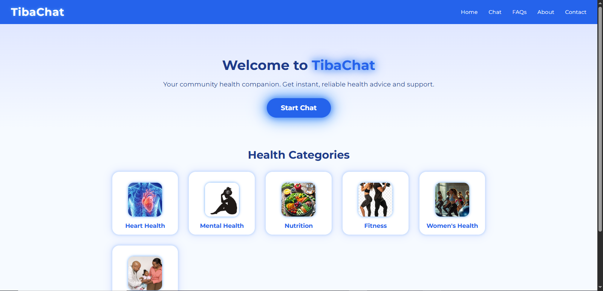
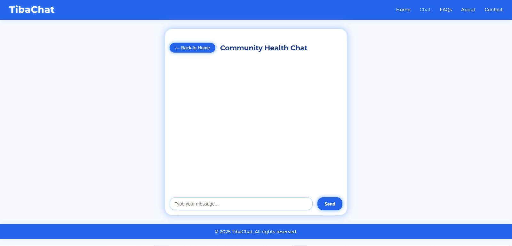
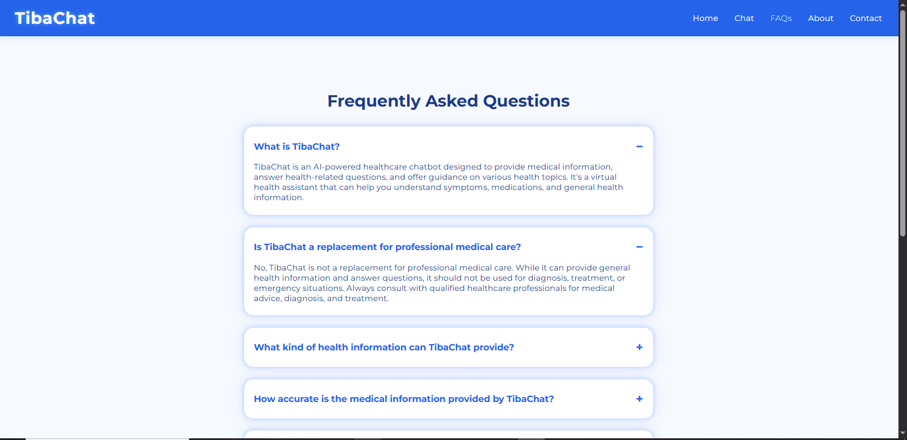
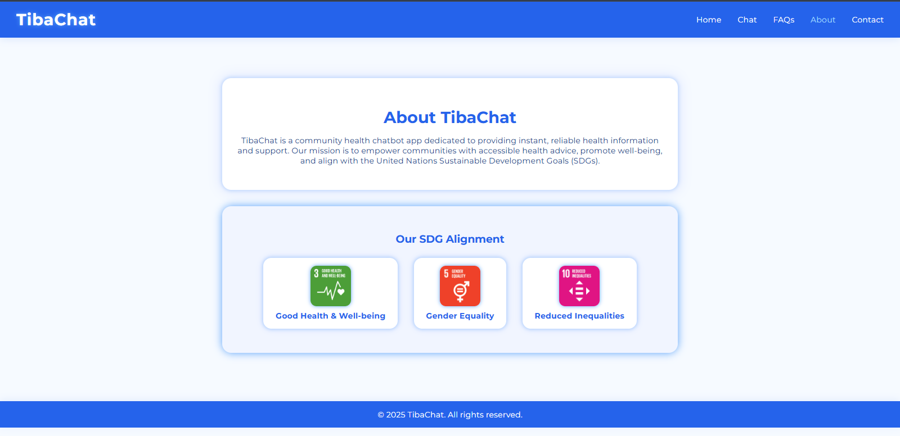

# TibaChat

TibaChat is a community health chatbot web application designed to provide instant, reliable health information and support through an AI-powered chat interface. The platform features categorized FAQs, real-time chat, and community-driven resources to improve health literacy and engagement.

---

## Table of Contents
- [Features](#features)
- [Tech Stack](#tech-stack)
- [Project Structure](#project-structure)
- [Setup & Installation](#setup--installation)
- [Environment Variables](#environment-variables)
- [Running the Project](#running-the-project)
- [How the Project Operates](#how-the-project-operates)
- [API Endpoints](#api-endpoints)
- [Contributing](#contributing)
- [License](#license)

---

## Features
- **AI-powered health chatbot** for instant Q&A
- **Categorized FAQs** for quick access to common health questions
- **Community chat** for peer support and discussion
- **Admin panel** for managing content and categories
- **RESTful API** for extensibility

---

## Tech Stack
- **Frontend:** HTML, CSS, JavaScript
- **Backend:** Node.js, Express.js
- **Database:** MongoDB (Cloud)
- **Package Manager:** pnpm
- **Deployment:** Vercel (frontend), Render/Railway/Heroku (backend)

---

## Project Structure
```
TibaChat/
  backend/
    config/
    controllers/
    middleware/
    models/
    routes/
    server.js
    package.json
    .env
  frontend/
    css/
    js/
    assets/
    index.html
    chat.html
    about.html
    contact.html
    faqs.html
  README.md
```

---

## Screenshots

### Home Page

*The landing page of TibaChat. Users are welcomed and can navigate to other sections such as chat, FAQs, about, and contact. It provides an overview of the platform and its purpose.*

### Chat Page

*The main interface for interacting with the AI-powered chatbot. Users can type health-related questions and receive instant responses. The chat page may also display previous conversations and community messages.*

### FAQs Page

*Displays a categorized list of frequently asked health questions and answers. Users can browse or search for information on common health topics, improving accessibility to reliable information.*

### About Page

*Provides background information about TibaChat, its mission, and the team or organization behind the project. This page helps build trust and transparency with users.*

### Contact Page

*Allows users to reach out for support, feedback, or partnership inquiries. Includes a contact form or contact details for the TibaChat team.*

### Render Deployment Logs

*Shows the deployment logs from Render, including build and server startup information. Useful for debugging and verifying successful backend deployment.*

### Vercel Deployment

*Displays the deployment status and logs from Vercel, confirming that the frontend has been successfully deployed and is accessible online.*

---

## Setup & Installation

### 1. Clone the repository
```sh
git clone https://github.com/brown-skin-bala/TibaChat.git
cd TibaChat
```

### 2. Backend Setup
```sh
cd backend
pnpm install
```

### 3. Frontend Setup
No build step required for static frontend.

---

## Environment Variables
Create a `.env` file in the `backend` directory with the following:
```
MONGO_URI=your_mongodb_connection_string
PORT=5000
```

---

## Running the Project

### Backend
```sh
cd backend
pnpm start
```
The backend will run on `http://localhost:5000` by default.

### Frontend
Open `frontend/index.html` in your browser, or deploy the `frontend` folder to a static hosting service (e.g., Vercel).

---

## How the Project Operates
- **Frontend:** Users interact with the chatbot and browse FAQs through a simple web interface. The frontend sends requests to the backend API for chat responses, FAQs, and categories.
- **Backend:** The Express.js server handles API requests, connects to MongoDB for data storage, and serves categorized FAQs, chat messages, and categories. The backend also manages admin operations for content management.
- **Database:** MongoDB stores user messages, FAQs, and categories, enabling dynamic content and community-driven updates.
- **API:** The backend exposes RESTful endpoints for chat, FAQs, and categories, which the frontend consumes.

---

## API Endpoints
- `GET /api/faqs` - Retrieve all FAQs
- `GET /api/categories` - Retrieve all categories
- `POST /api/chats` - Send a chat message
- (Add more endpoints as needed)

---

## Contributing
Contributions are welcome! Please open issues or submit pull requests for improvements or bug fixes.

---

## License
This project is licensed under the MIT License.